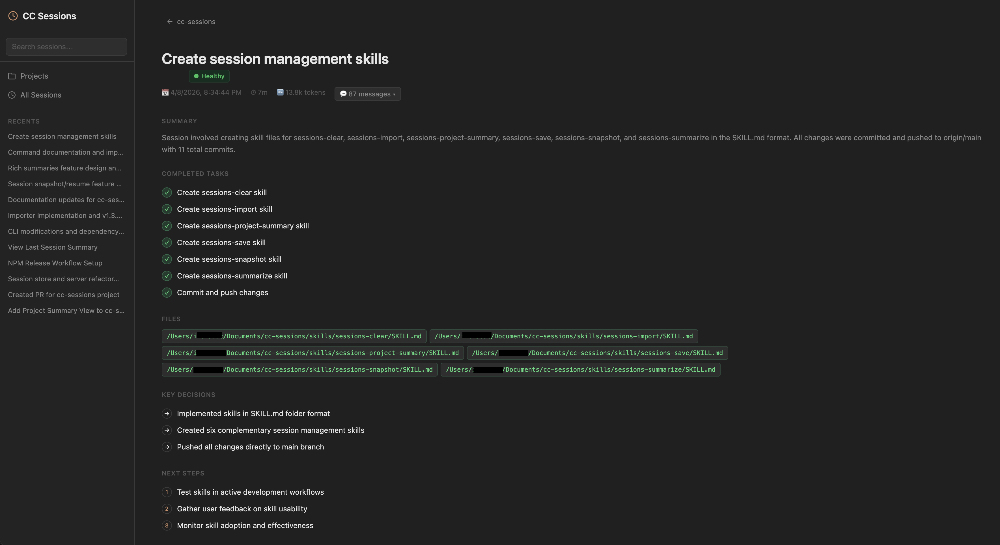
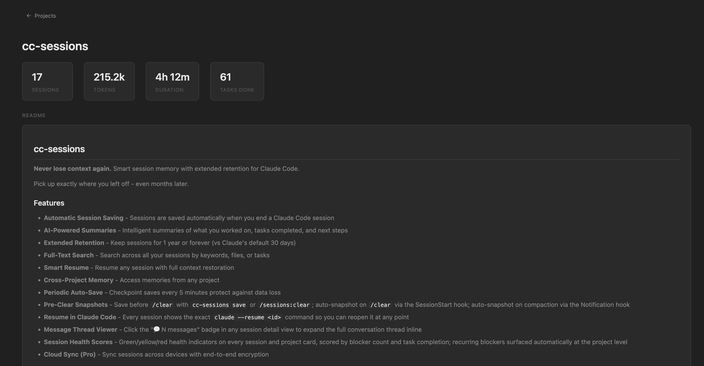

# cc-sessions

**Your AI coding sessions deserve a memory.**

cc-sessions adds memory, observability, and replay to Claude Code.

---

## The problem

AI coding sessions are fragile:

- You lose context after a few days
- You can't remember why decisions were made
- Debugging a past session is impossible
- Important insights disappear into chat logs

cc-sessions fixes that.

---

## What you get

With cc-sessions you can:

- **Resume any session** exactly where you left off — even months later
- **See what actually happened** — tasks, decisions, blockers, files changed
- **Detect struggling sessions instantly** — green/yellow/red health scores with recurring blockers surfaced automatically
- **Search across all your past work** — full-text, across every project

---

## See it in action

### Session detail — tasks, decisions, next steps at a glance



### Project dashboard — aggregate stats, health, and memory



---

## Why not just use Claude?

| | Claude Code | cc-sessions |
|---|---|---|
| History | ~30 days | 1 year or forever |
| View | Messages | Structured summaries |
| Health | None | Green / yellow / red |
| Search | Within session | Across all sessions |
| Resume | Manual copy-paste | One command |
| Memory | Auto-memory files | Browsable + editable UI |

---

## Who is this for?

- Developers using Claude Code daily who lose context between sessions
- Anyone building with AI-assisted workflows who needs to understand what happened
- Teams who want visibility into AI coding work across projects

---

## Quick start

```bash
# Install globally
npm install -g @iam-dev/cc-sessions

# Import your existing sessions
cc-sessions import --limit 9999

# Open the browser UI
cc-sessions ui
```

Or install as a Claude Code plugin for automatic saving on every session (see [Installation](#installation)).

---

## Core features

### Memory
- Automatic session saving — on end, every 5 min, and before `/clear`
- Extended retention — 1 year or forever vs Claude's 30-day default
- Cross-project access — search across all your past work

### Observability
- **Session health scores** — green/yellow/red per session and project, scored by blockers and task completion
- **Recurring blockers** — surfaced automatically at the project level
- **Structured summaries** — tasks completed, key decisions, next steps, files changed

### Workflow
- **Smart resume** — `claude --resume <id>` shown in UI with copy button
- **Full-text search** — keywords, files, tasks across all sessions
- **Message thread viewer** — expand the full conversation inline
- **Claude Code Memory UI** — browse, search, and edit auto-memory files and `CLAUDE.md` directly

---

## Installation

### Option 1: Claude Code Plugin (Recommended)

```bash
git clone https://github.com/iam-dev/cc-sessions.git ~/.cc-sessions-plugin
cd ~/.cc-sessions-plugin
npm install && npm run build
```

Load automatically in all sessions by adding to `~/.claude/settings.json`:

```json
{
  "plugins": ["~/.cc-sessions-plugin"]
}
```

Then start Claude Code — sessions save automatically.

### Option 2: NPM Package (CLI only)

```bash
npm install -g @iam-dev/cc-sessions
```

Gives you `cc-sessions` CLI commands but requires manual hook setup for auto-saving.

---

## Commands

### `/sessions`
Show summary of the last session in this project.

### `/sessions:list`
Browse all saved sessions.

```
/sessions:list
/sessions:list --project ./myapp
/sessions:list --limit 20
/sessions:list --all  # Include archived
```

### `/sessions:search <query>`
Search across all saved sessions.

```
/sessions:search authentication
/sessions:search "bug fix" --project ./myapp
/sessions:search refactor --from "last month"
```

### `/sessions:resume [session-id]`
Resume a session with full context restoration.

```
/sessions:resume
/sessions:resume mem_abc123_xyz789
```

### `/sessions:clear`
Save the current session with a full AI summary, then clear context. Use this instead of `/clear`.

### `/sessions:snapshot`
Save the current session immediately — use before `/clear` to preserve context.

### `/sessions:import`
Import all Claude Code CLI sessions from `~/.claude/projects/`.

```
/sessions:import
/sessions:import --limit 9999
/sessions:import --no-ai
/sessions:import --since 2025-01-01
/sessions:import --dry-run
```

### `/sessions:summarize`
Regenerate AI-powered summaries for sessions that only have rule-based summaries.

```
/sessions:summarize
/sessions:summarize --all
/sessions:summarize --all --limit 9999
```

### `/sessions:export [session-id]`
Export session to markdown or JSON.

```
/sessions:export
/sessions:export --format json
/sessions:export --output ./notes.md
```

### `/sessions:settings`
View and configure memory settings.

---

## Snapshots & Resume

### Save before `/clear`

```bash
cc-sessions save
# ✅ Session saved: abc123-def456 (pre-clear snapshot)
```

Then resume it anytime:

```bash
claude --resume abc123-def456
```

The `claude --resume` command is also shown with a copy button in the session detail view.

### Auto-save on `/clear`

Register the SessionStart hook to automatically save whenever you type `/clear`:

```json
// ~/.claude/settings.json
{
  "hooks": {
    "SessionStart": [
      {
        "matcher": "clear",
        "hooks": [{ "type": "command", "command": "cc-sessions on-clear" }]
      }
    ]
  }
}
```

### Auto-snapshot on compaction

Register the Notification hook to automatically save when Claude Code compacts context:

```json
{
  "hooks": {
    "Notification": [
      { "matcher": "", "hooks": [{ "type": "command", "command": "cc-sessions notify" }] }
    ]
  }
}
```

Both hooks are set up automatically when using the plugin.

---

## Importing Existing Sessions

```bash
cc-sessions import --limit 9999
```

> **Important:** Default `--limit` is 100. Always pass `--limit 9999` to import your full history.

Re-running import is safe — sessions already in the database are skipped.

### Retroactive AI Summaries

After importing, sessions without AI access are tagged `no-ai-summary`. Upgrade them anytime:

```bash
cc-sessions summarize              # upgrade no-ai-summary sessions
cc-sessions summarize --all        # force-regenerate every session
cc-sessions summarize --no-ai      # rule-based only (no API key needed)
```

Provider chain: **CC CLI** (`claude` binary) → **Anthropic API** (`ANTHROPIC_API_KEY`) → rule-based fallback.

---

## Claude Code Memory

cc-sessions makes Claude Code's built-in memory browsable and editable in the UI.

| Source | Location |
|--------|----------|
| Auto-memory | `~/.claude/projects/<encoded>/memory/*.md` |
| CLAUDE.md | `<project>/CLAUDE.md` or `<project>/.claude/CLAUDE.md` |

**Memory sidebar** — search across all indexed memory entries from every project.

**Project Memory tab** — edit auto-memory cards and CLAUDE.md inline, changes write back to disk instantly.

### REST API

```
GET  /api/memory?project=<path>       # all entries for a project
GET  /api/memory/search?q=<query>     # full-text search (all projects)
PUT  /api/memory/:id                  # update name / description / body
POST /api/memory/sync                 # sync a project { projectPath }
POST /api/memory/create-claude-md     # create CLAUDE.md { projectPath, content }
```

---

## Configuration

`~/.cc-sessions/config.yml`:

```yaml
retention:
  full_sessions: 1y        # 7d, 30d, 90d, 180d, 1y, 2y, 5y, forever
  archives: forever
  override_claude_retention: true
  max_storage_gb: 10

auto_save:
  enabled: true
  interval_minutes: 5
  generate_summary: true

summaries:
  model: haiku             # haiku (~$0.001/summary) or sonnet (~$0.01/summary)
```

---

## Cloud Sync (Pro)

Sync sessions across devices with end-to-end encryption (AES-256-GCM, key never leaves your device).

Supported providers: **Cloudflare R2**, **AWS S3**, **Backblaze B2**

```yaml
cloud:
  enabled: true
  provider: r2
  bucket: my-sessions-bucket
  endpoint: https://ACCOUNT_ID.r2.cloudflarestorage.com
  access_key_id: YOUR_ACCESS_KEY
  secret_access_key: YOUR_SECRET_KEY
  sync_on_save: true
```

See [Cloud Sync Documentation](https://iam-dev.github.io/cc-sessions/cloud-sync.html) for full setup.

---

## API Usage

```typescript
import { SessionStore, loadConfig, parseLogFile } from '@iam-dev/cc-sessions';

const store = new SessionStore();
const lastSession = store.getLastForProject('/path/to/project');
const results = store.search('authentication');
store.close();
```

---

## How It Works

Sessions are stored in SQLite (`~/.cc-sessions/index.db`) with FTS5 full-text search. cc-sessions reads Claude Code's JSONL logs from `~/.claude/projects/` and extracts messages, tool calls, token usage, and duration.

**Session lifecycle:**
1. **SessionStart** — shows last session summary
2. **Periodic Save** — checkpoint every 5 minutes
3. **Notification** — auto-snapshots on context compaction
4. **Manual snapshot** — `cc-sessions save` or `/sessions:clear`
5. **SessionEnd** — full AI summary generated and saved

---

## Troubleshooting

**Sessions not saving?** Check that the plugin is loaded, `~/.cc-sessions/config.yml` exists, and `auto_save.enabled: true`.

**Search not finding results?** Search is case-insensitive — try broader terms, or use `/sessions:list` to browse.

**Storage too large?** Lower `retention.full_sessions: 30d` or `max_storage_gb: 5`.

---

## Documentation

Full docs at **[iam-dev.github.io/cc-sessions](https://iam-dev.github.io/cc-sessions/)**

- [Installation Guide](https://iam-dev.github.io/cc-sessions/installation.html)
- [Command Reference](https://iam-dev.github.io/cc-sessions/commands.html)
- [Configuration](https://iam-dev.github.io/cc-sessions/configuration.html)
- [Cloud Sync Setup](https://iam-dev.github.io/cc-sessions/cloud-sync.html)
- [API Reference](https://iam-dev.github.io/cc-sessions/api.html)

---

## Development

```bash
git clone https://github.com/iam-dev/cc-sessions.git
cd cc-sessions
npm install
npm run build
npm test
```

---

## License

MIT — see [LICENSE](LICENSE) for details.

## Contributing

Contributions welcome. Read [CONTRIBUTING.md](CONTRIBUTING.md) first.

## Support

- **Issues:** [GitHub Issues](https://github.com/iam-dev/cc-sessions/issues)
- **Discussions:** [GitHub Discussions](https://github.com/iam-dev/cc-sessions/discussions)

---

Made with Claude Code.
